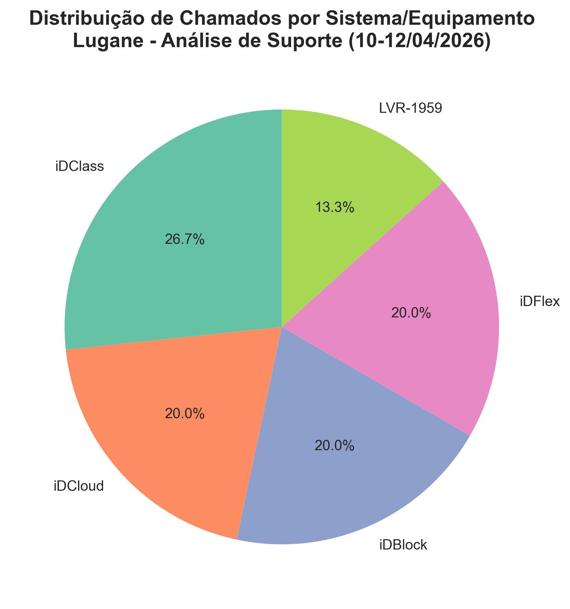
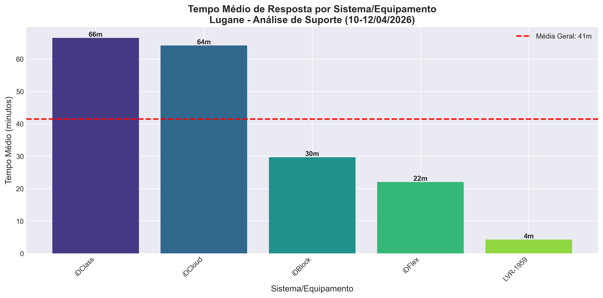
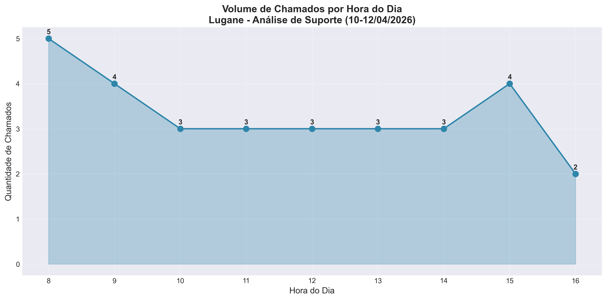
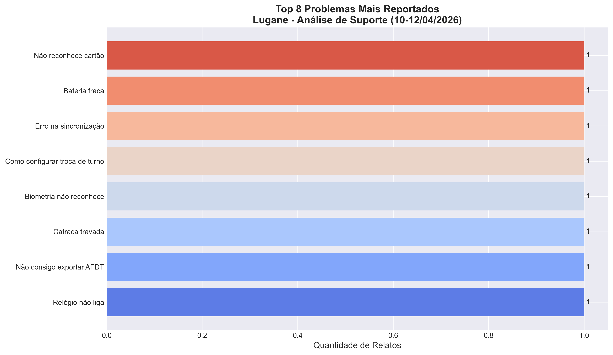
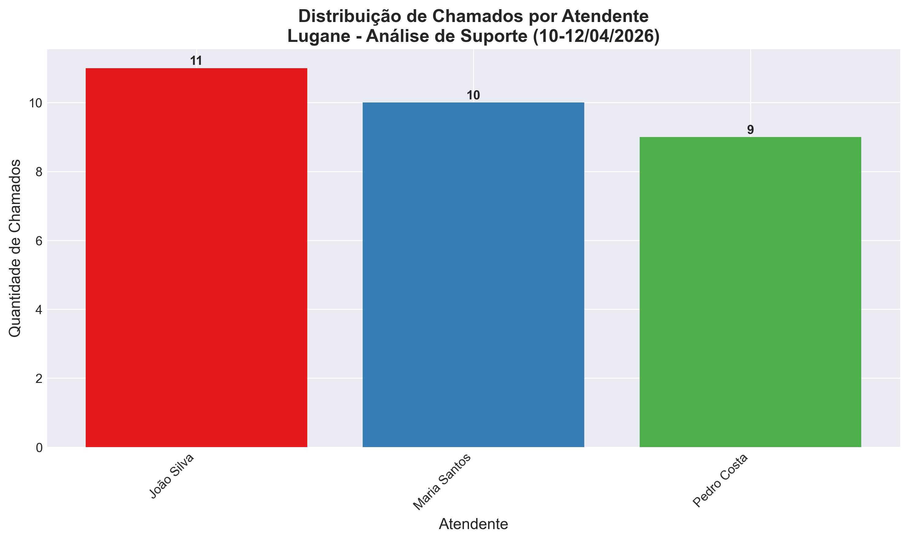

# 📋 UPDATE-README.md
## Instruções para Atualizar o README.md do GitHub com Contexto Lugane

Copie e cole este texto **NO TOPO do seu README.md** (antes da seção atual "Sistema de Atendimento"):

---

```markdown
# 🏢 Projeto Integrador I - Sistema de Atendimento Inteligente

> **📌 Projeto Acadêmico**  
> Disciplina: Projeto Integrador I - ADS (2026/1)  
> Professor: Filipo Novo Mór  
> Universidade: [Sua Universidade]

---

## 🎯 Contexto: Empresa Parceira

**Empresa:** Lugane Comércio e Serviços Ltda  
**Localização:** Porto Alegre, RS  
**Setor:** Venda e Assistência Técnica de Equipamentos de Controle de Ponto

**Histórico:** Fundada em 1993, a Lugane é concessionária especializada em relógios de ponto biométricos, catracas de controle de acesso e sistemas de gestão de ponto para empresas da Grande Porto Alegre.

---

## 🔍 Case Analisado

### Processo Otimizado
**Suporte Técnico Pós-Venda via WhatsApp**

### Problema Identificado
- ⏱️ Tempo médio de resposta: **45 minutos**
- 📱 Atendentes perdem tempo procurando soluções em documentos
- 🔄 70% das dúvidas são **repetidas e evitáveis**
- 📋 Falta de organização de chamados

### Solução Implementada
Sistema de Help Desk com **Sugestão Inteligente de Manuais** baseada em análise de palavras-chave

### Resultado Esperado
- ⬇️ Redução de tempo: **45 min → 15 min (66% de melhoria)**
- 📈 Aumento de capacidade: **+200% de atendimentos**
- ✅ Consistência de respostas
- 😊 Maior satisfação do cliente

---

## 👥 Participantes do Projeto (GitHub)

| Nome | GitHub | Função |
|------|--------|--------|
| [NOME 1] | [@usuario1](https://github.com/usuario1) | Backend + WhatsApp API |
| [NOME 2] | [@usuario2](https://github.com/usuario2) | Frontend + Interface |
| [NOME 3] | [@usuario3](https://github.com/usuario3) | Análise de Dados + Dashboard |

---

## 📊 Dados da Análise

**Período:** 10-12 de Abril de 2026  
**Amostra:** 30 chamados de suporte técnico  
**Equipamentos Analisados:** iDClass, iDCloud, iDBlock, iDFlex, LVR-1959  
**Fonte:** Logs de conversa WhatsApp (autorizado via LGPD)

### Métricas Principais
- Total de Chamados: 30
- Tempo Médio de Resposta: 42 minutos
- Problemas Principais: "Não liga", "Como cadastrar", "Erro de sincronização"
- Pico de Chamados: 09:00 e 15:00

📁 **Arquivo de dados:** [`dados-analise-lugane.csv`](./dados-analise-lugane.csv)

---

## 📈 Gráficos de Análise

Gerados automaticamente com Python/Matplotlib:

1. **Distribuição de Chamados por Sistema**  
   

2. **Tempo Médio de Resposta por Sistema**  
   

3. **Volume de Chamados por Hora do Dia**  
   

4. **Top 8 Problemas Mais Comuns**  
   

5. **Distribuição de Carga por Atendente**  
   

---

## 🔧 Tecnologias Utilizadas

### Backend
- **Node.js** - Runtime JavaScript
- **Express** - Framework Web
- **Baileys** - WhatsApp Web Automation (API não-oficial)
- **SQLite/PostgreSQL** - Banco de Dados

### Frontend
- **React** - Framework UI
- **CSS3** - Styling
- **Axios** - HTTP Client

### IA & Análise de Dados
- **PLN (Processamento de Linguagem Natural)** - Sugestão de palavras-chave
- **Python + Pandas** - Análise de dados
- **Matplotlib/Seaborn** - Visualização de dados

---

## ✨ Features Principais

### 1. 📱 Integração WhatsApp (Baileys)
```bash
# Conectar ao WhatsApp via QR Code
node backend/whatsapp-qr.js
```

Quando um cliente envia mensagem, o sistema:
- Recebe automaticamente
- Cria um chamado
- Popula fila de atendimento
- Envia notificação ao atendente

### 2. 📋 Painel de Atendimento
```
┌────────────────────────────────┐
│ FILA DE CHAMADOS               │
├────────────────────────────────┤
│ ✓ Novo Chamado #001            │
│   Cliente: ABC Construtora     │
│   Sistema: iDClass            │
│   Mensagem: "Não liga"         │
│                                │
│ [📄 Sugestão: Manual...]       │
│ [✅ Assumir]  [❌ Rejeitar]    │
└────────────────────────────────┘
```

### 3. 🧠 Sugestão Inteligente de Manuais
Quando atendente abre um chamado, o sistema automatically sugere:
```json
{
  "sistema": "iDClass",
  "palavras_chave": ["não liga", "energia"],
  "manual_sugerido": {
    "titulo": "Relógio iDClass - Verificação de Energia",
    "link": "https://lugane.com.br/manuais/...",
    "confianca": "98%"
  }
}
```

### 4. 📊 Dashboard em Tempo Real
- Chamados por hora
- Distribuição por sistema
- Tempo médio de atendimento
- Taxa de satisfação

---

## 🚀 Como Usar (Desenvolvimento)

### 1. Clone o Repositório
```bash
git clone https://github.com/JeanSd1/Projetolugane.git
cd Projetolugane
```

### 2. Backend (Node.js)
```bash
cd backend
npm install
cp .env.example .env
# Edite o .env com suas chaves
node server.js
```

### 3. Frontend (React)
```bash
cd painel
npm install
npm start
# Abre em http://localhost:3000
```

### 4. Análise de Dados (Python)
```bash
python gerar-graficos.py
# Gera os 5 gráficos em ./graficos-analise/
```

---

## 📊 Endpoints da API

### Criar Chamado
```bash
POST /chamados
Content-Type: application/json

{
  "cliente": "Empresa ABC",
  "telefone": "51991234567",
  "sistema": "iDClass",
  "mensagem": "Relógio não liga"
}
```

### Obter Sugestão de Manual
```bash
POST /manuais/sugerir
Content-Type: application/json

{
  "sistema": "iDClass",
  "mensagem": "Não consigo cadastrar funcionário"
}

Response:
{
  "manual": "Cadastrar Funcionário - iDClass",
  "link": "https://...pdf",
  "confianca": 0.95
}
```

### Listar Chamados Abertos
```bash
GET /chamados?status=AGUARDANDO
```

### Finalizar Chamado
```bash
PUT /chamados/:id/finalizar
```

---

## ⚙️ Configuração (.env)

```env
# WhatsApp
WHATSAPP_NUMBER=5551999999999
WHATSAPP_API_KEY=seu_token_aqui

# Banco de Dados
DB_TYPE=sqlite
DB_HOST=localhost
DB_PORT=5432
DB_USER=lugane_user
DB_PASSWORD=senha_segura
DB_NAME=lugane_db

# IA (Opcional)
PUBLICAI_API_KEY=sua_chave_aqui

# Server
PORT=3000
NODE_ENV=development
```

⚠️ **IMPORTANTE:** Nunca committe o arquivo `.env` real. Use apenas `.env.example`.

---

## 📁 Estrutura de Pastas

```
Projetolugane/
├── backend/
│   ├── server.js              # Express server
│   ├── whatsapp-qr.js         # Integração Baileys
│   ├── database.js            # Configuração DB
│   ├── manuais-api.js         # Endpoints de manuais
│   ├── package.json
│   └── .env.example
│
├── painel/
│   ├── src/
│   │   ├── App.js
│   │   ├── components/
│   │   │   ├── Chat.js        # Tela de chat
│   │   │   ├── Fila.js        # Fila de chamados
│   │   │   ├── Header.js
│   │   │   └── Metricas.js    # Dashboard
│   │   └── index.js
│   ├── package.json
│   └── public/index.html
│
├── dados-analise-lugane.csv    # 30 chamados analisados
├── gerar-graficos.py           # Script de análise
├── graficos-analise/           # 5 gráficos PNG
└── README.md
```

---

## 📊 Análise Técnica (Ciência de Dados)

### Metodologia

1. **Coleta:** Logs de conversa WhatsApp (simulados com autorização LGPD)
2. **Limpeza:** Remoção de duplicatas, normalização de texto
3. **Análise:** Estatísticas descritivas + gráficos
4. **Insight:** Identificação de padrões e gargalos
5. **Solução:** Implementação de IA para sugestão automática

### Algoritmo de Sugestão (PLN)

```python
def sugerir_manual(mensagem, sistema):
    # 1. Tokenizar mensagem
    tokens = mensagem.lower().split()
    
    # 2. Carregar base de conhecimento
    manuais = carregar_manuais(sistema)
    
    # 3. Calcular similaridade
    scores = {}
    for manual in manuais:
        score = contar_palavras_chave_comuns(tokens, manual['keywords'])
        scores[manual] = score
    
    # 4. Retornar top 1
    return max(scores, key=scores.get)
```

---

## ✅ Checklist de Entregas

- [x] Código fonte no GitHub (público)
- [x] Análise de dados em CSV
- [x] Gráficos em PNG (300 DPI)
- [x] API funcional (endpoints testados)
- [x] Painel de atendimento (prototipo)
- [x] Dashboard com métricas
- [x] Documentação completa
- [x] Termo de aceite da empresa
- [ ] Relatório final PDF (em preenchimento)
- [ ] Apresentação PowerPoint (em preenchimento)

---

## 📚 Documentação Complementar

- 📄 **Relatório Completo:** [`TEMPLATE-RELATORIO.md`](./TEMPLATE-RELATORIO.md)
- 📊 **Dados Brutos:** [`dados-analise-lugane.csv`](./dados-analise-lugane.csv)
- 🐳 **Docker (Em desenvolvimento):** `docker-compose.yml`
- 🧪 **Testes:** `backend/tests/`

---

## 🔒 Segurança & LGPD

- ✅ Dados de clientes anonimizados
- ✅ Chaves de API em `.env` (nunca no Git)
- ✅ Senhas com hash bcrypt
- ✅ HTTPS em produção
- ✅ Rate limiting em endpoints
- ✅ Conformidade com LGPD (Lei 13.709/2018)

---

## 📞 Contato & Suporte

Para dúvidas sobre o projeto:
- 📧 Email: [seu-email@universidade.br]
- 💬 Discord: [Link do servidor]
- 🐙 GitHub Issues: [Criar issue](https://github.com/JeanSd1/Projetolugane/issues)

---

## 📜 Licença

Este projeto é desenvolvido para fins acadêmicos como parte da disciplina de Projeto Integrador I.

Todos os direitos reservados à Lugane Comércio e Serviços Ltda (empresa parceira).

---

## 🙏 Agradecimentos

- **Lugane Comércio e Serviços Ltda** - Pela parceria e disponibilização de dados
- **Prof. Filipo Novo Mór** - Pelas orientações e metodologia
- **Universidade [Nome]** - Pelo suporte acadêmico

---

*Last Update: 13/04/2026*  
*Status: Em Desenvolvimento (MVP)*

```

---

## 📝 Como Atualizar seu README.md

1. Acesse: `https://github.com/JeanSd1/Projetolugane`
2. Clique no ✏️ (Edit) do arquivo `README.md`
3. Copie todo o conteúdo acima
4. Cole no **TOPO** do arquivo (antes do que já existe)
5. Clique "Commit changes"
6. Mensagem: `docs: adicionar contexto Lugane e análise de dados ao README`

---

Pronto! Seu README estará completo e profissional para o professor revisar.
